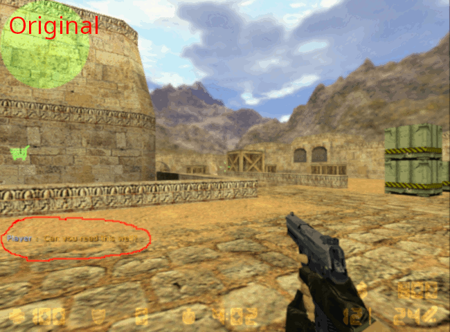
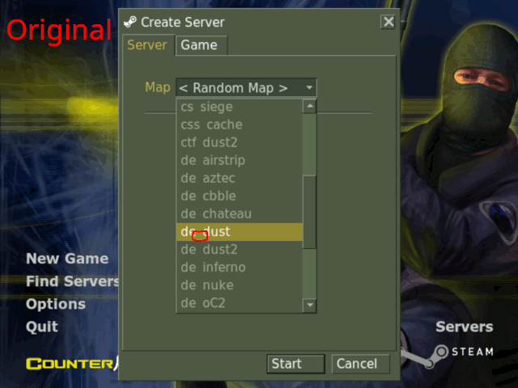

# Half-Life (GoldSrc) Linux Font Patches
[](https://hits.sh/github.com/magynhard/halflife_goldsrc_linux_font_patches/)

> Patch unreadable fonts on Half-Life 1 (GoldSrc) based games on Linux.

```diff
- This patch can break after the 25th anniversary update. You will need to reinstall and repatch again.
```







### There are patches available for
* Counter-Strike 1.6
* Day of Defeat 1.2


### How the patch works

At first it will install a free, readable font for chatting, similar to the original one. Then it will add and apply custom scheme files. The scheme refers to the installed font as well as using fonts from the *Noto* font family.

# Installation
## Automatic installer
### Install
Run
```bash
\curl -sSL https://raw.githubusercontent.com/magynhard/halflife_goldsrc_linux_font_patches/master/setup.sh | ACTION=install bash
```
in your terminal to run the automatic installer script.

### Uninstall
To uninstall you can run the following command:

```bash
\curl -sSL https://raw.githubusercontent.com/magynhard/halflife_goldsrc_linux_font_patches/master/setup.sh | ACTION=uninstall bash
```

## Additional improvements
### Default Font
The patch refers to `Noto` as default font, but will fallback to your system font. If you want to use the optimitzed Noto fonts, ensure that they are installed on your system.

They are included in the following packages:

| Distribution | Package      | Info                          |
|--------------|--------------|-------------------------------|
| Ubuntu | `fonts-noto` | `sudo apt install fonts-noto` |
| Arch / Manjaro | `noto-fonts` | `sudo pacman -S noto-fonts`   |


### Symbols
To get symbol icons working well (when using spectator mode and its dropdowns), you need to install the MS fonts package of your linux distribution.

The symbol fonts name is `Marlett`. It is included in the following packages:

| Distribution | Package             | Info                |
|--------------|---------------------|---------------------|
| Ubuntu | `ttf-mscorefonts-installer`                    | `sudo apt install ttf-mscorefonts-installer` |
| Arch / Manjaro | `ttf-ms-win11-auto` | AUR repository      |
